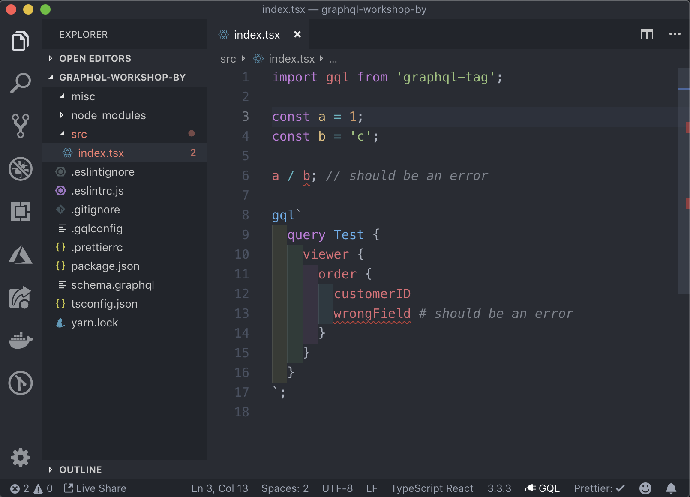

# GraphQL Workshop Kyiv (2019-05-11)

## Разминка в терминале/консоле

Для того, чтобы не тратить впустую время на воркшопе:

- на установку пакетов
- установку софта и плагинов
- на ожидание интернета, который пригружают соседи

Прошу вас склонировать эту репку:

```bash
git clone https://github.com/nodkz/graphql-workshop-ua.git
```

Зайти в папку с проектом и **установить пакеты**:

```bash
cd graphql-workshop-ua
yarn install
```

Да, мы будем использовать [yarn](https://yarnpkg.com/lang/en/docs/install/) в качестве менеджера пакетов здорового человека.

## Установка и настройка VSCode

[VSCode](https://code.visualstudio.com/) бесплатен и имеет кучу хороших плагинов. Atom проиграл войну еще года полтора, а после покупки Микрософтом – про него вообще можно забыть. Вобщем поставив и настроив VSCode, вы будите чувствовать себя не хуже чем в Вебшторме, а может быть даже и лучше.

После установки VSCode, необходимо установить следующие расширения:

- `graphql-for-vscode` – (обязательно) для автокомплита GraphQL-запросов. Требует дополнительной установки [Watchman'а](https://facebook.github.io/watchman/docs/install.html) в вашей системе. ☝️
- `prettier-vscode` – (обязательно) чтоб форматировать код и не тратить время на пробелы и табы
- `vscode-eslint` – (обязательно) для подсветки ошибок линтинга
- `auto-rename-tag` – чтобы JSX теги переименовывались вместе
- `gitlens` – няшный дополнительный GIT
- `indent-rainbow` – чтоб красиво красились отступы
- `node-module-intellisense` – автоподстановка модулей при импорте
- `vscode-great-icons` – ставит иконки к файлам, чтоб их легче различать
- `theme-onedark-sublime` – темная тема из атома (работаю на ней)
- `vscode-language-babel` – в хозяйстве пригодится
- есть еще что добавить без чего жизнь совсем плоха?! – открой Pull Request

## Проверка по скриншоту

Если все склонировали, установили пакеты, скачали VSCode и плагины к нему. Установили Watchman. И перезапустили VSCode после всех установок, то должны получить вот такой скриншот:



- `a / b; // should be an error` – говорит что c node_modules все нормально и все пакеты через `yarn install` установлены. Иначе либо пакеты не установлены, либо отключен встроенный плагин в VSCode по лингтингу тайпскрипта.
- `wrongField # should be an error` – проверяет что установлен `Watchman` в системе; и плагин к VSCode `graphql-for-vscode`.

## И самое главное

Установите к себе на десктоп [Telegram](https://telegram.org/). Через него я буду отправлять куски кода до того, как они будут попадать в ветку на гитхабе. Это позволит меньше печатать и не отстать от группы.

<!-- Ссылка для присоединения к закрытой группе в телеграмме: [https://t.me/joinchat/A11zfFSAf_o_llsWSc2_xg](https://t.me/joinchat/A11zfFSAf_o_llsWSc2_xg) -->
